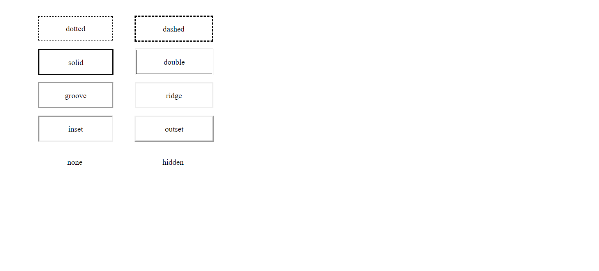

## Screenshots
## Buttons:

## Borders:

# Background
#### The background properties are used to add background effects for elements such as color, image, size, position and attachment. The shorthand property can be used to set all the background type properties.

# Some Background Type Properties are:

## background-color
#### This background property is used to set background color of an element. It requires color name or code number as it's value.
###  Example : background-color : red;

## background-image
####  This background property is used to set one or more images on an element at background. It requires url of the images as it's value.
###  Example : background-image : url("../../media/examples/apple.png");

## background-size
####  This background property is used to set the size of the background image.
###  Example : background-size : auto;

## background-position
####  This background property is used to set the initial position for each background image.
###  Example : background-position : center;
            
## background-attachment
####  This background property is used to set whether a background image's position is fixed within the viewport, or scroll with its containing block.
###  Example : background-attachment : scroll;