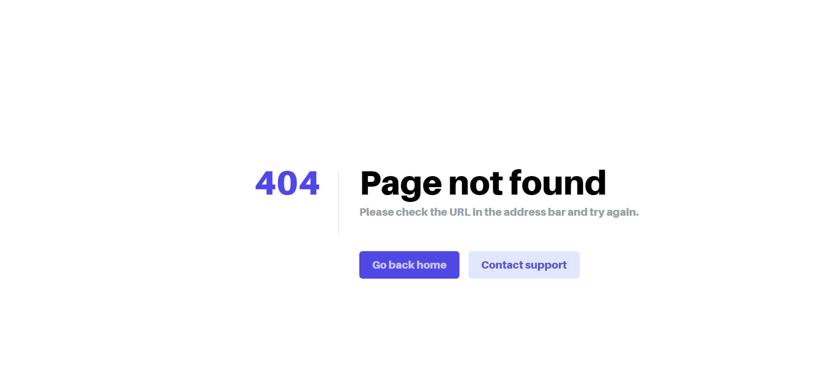
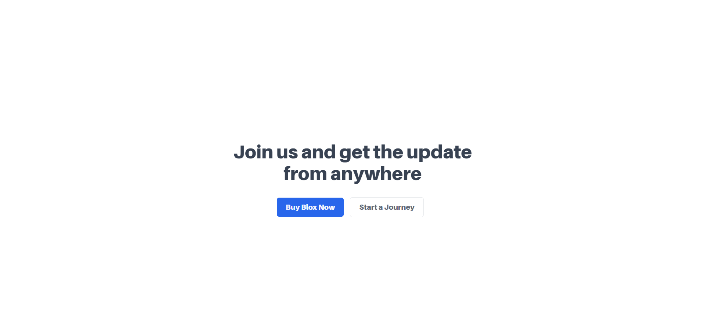
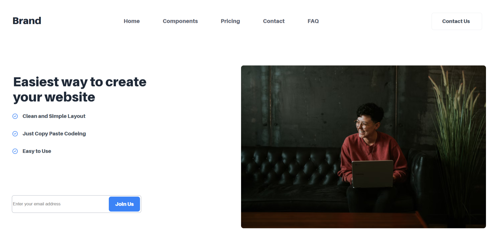
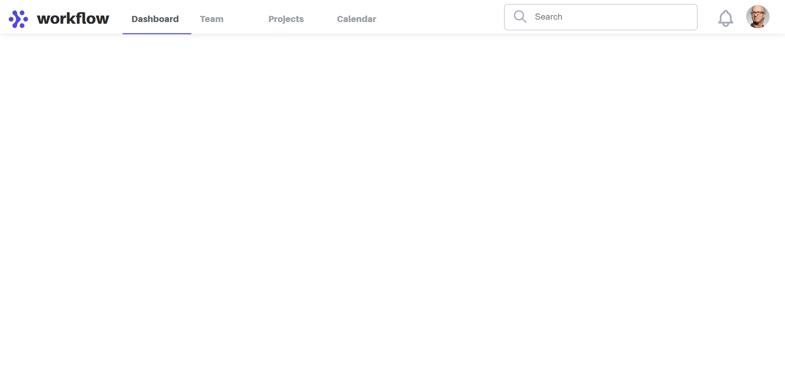

## Deadline : 19th May 2022 - 2nd June 2022
## Live Web Pages : 
## 404 Page : 
## Live Web Page : (https://www.aayushsth.com.np/Lab/Lab4/404.html)

---
## CTA Section : 
## Live web Page : (https://www.aayushsth.com.np/Lab/Lab4/ctasection.html)

---
## Hero Section : 
## Live Web Page : (https://www.aayushsth.com.np/Lab/Lab4/hero.html)

---
## Navbar Section : 
## Live Web Page : (https://www.aayushsth.com.np/Lab/Lab4/nav.html)


## CSS Layout
#### - Layout means the way the elements of the web pages are positioned throughout. In CSS, we can use different css layout techniques to control the position of the elements contain in a web page by considering different factors such as their default position in normal layout flow, the other elements around them, their parent container, and the main viewport/window.

---

## Types of CSS Layout
---
### 1. Normal flow Layout
#### - Normal flow layout is the default/initial layout that browser lays on the HTML pages. So when we are not setting any form of layout in CSS of the HTML file, normal flow layout is set by default.

---

### 2. Positioning Layout
#### - This layout technique allows to move an element from where it would otherwise be placed in normal flow over to another location. 
#### - Positioning isn't a method for creating the main layouts of a page; it's more about managing and fine-tuning the position of specific items on a page. #### - To use this layout method, 'position' property is used and values in this property is used to set different types positioning layouts. 
#### - Elements are then positioned using the top, bottom, left, and right properties. However, these properties will not work unless the position property is set first. They also work differently depending on the position value.

***

### Types of Positioning Layout

***

### a. Static Positioning
#### - It is the default positioning that is set on the elements if no value or auto value is given on the position property.

## Syntax : 
```CSS
.a{
    position : auto;
}
```

***

### b. Relative Positioning
#### - Relative positioning allows you to modify an element's position on the page, moving it relative to its position in normal flow, as well as making it overlap other elements on the page.

### Syntax : 
```CSS
.b{
    position : relative;
}
```

***

### c. Absolute Positioning
#### - Absolute positioning set the position of the element on the based of it's closest parent that is positioned( parent with position property). It moves an element completely out of the page's normal layout flow, like it's sitting on its own separate layer.

### Syntax : 
```CSS
.c{
    position :absolute;
}
```
***

### d. Fixed Positioning
#### - Fixed positioning set the position of the element fixed relative to the browser viewport. This is very useful for creating navigation menu that has fixed position on the web page as it remains at same position on the screen as the rest of the content scrolls.

### Syntax : 
```CSS
.d{
    position : fixed;
}
```
***

### e. Sticky Positioning
#### - Sticky positioning is the newest among all of the positioning. It is similar to fixed positioning as it makes an element act like 'position: static' until it hits a defined offset from the viewport, at which point it acts like 'position: fixed'.

### Syntax : 
```CSS
.e{
    position : sticky;
}
```

---

### 3. Flexbox Layout
#### - Flexbox is the short name for the Flexible Box Layout CSS module, designed to make it easy for us to lay things out in one dimension — either as a row or as a column. 
#### - This is used for layouting the elements (flex items) that are under the parent element with 'display : flex' property. 
#### - It's default layout for the flex items is row. #### - The property 'flex-direciton' can be used to set the direction of the items layout such as row/horizontal, colume/vertical, reverse row/reverse horizontal, and reverse colume/ reverse vertical.

### Syntax : 
```CSS
.flex1{
    display : flex;
    flex-direction : row;
}

.flex2{
    display : flex;
    flex-direction : column;
}

.flex3{
    display : flex;
    flex-direction : row-reverse;
}

.flex4{
    display : flex;
    flex-direction : column-reverse;
}
```

---

### 4. Grid Layout
#### - While flexbox is designed for one-dimensional layout, Grid Layout is designed for two dimensions — lining things up in rows and columns.
#### - Similar to flexbox, to enable grid layout we use 'display : grid' property.
#### - Since it is designed for two dimensional layout , we define 'grid-template-rows' and 'grid-template-columns' properties for row and column respectively for the parent element's items.

### Syantax :
```CSS
.grid{
    display: grid;
    grid-template-columns: 15px 15px 15px;
    grid-template-rows: 30px 30px;
}
```

---

### 5. Float Layout
#### - Element with float layout changes the behavior of that element and the block level elements that follow it in normal flow. 
#### - 'float : float-value' is used to make an element floated.
#### - Floated element can be moved to left or right by using the float property with value 'left' and 'right' respectively.

### Syantax :
```CSS
.float-left{
    float : left;
}

.float-right{
    float : right;
}
```
